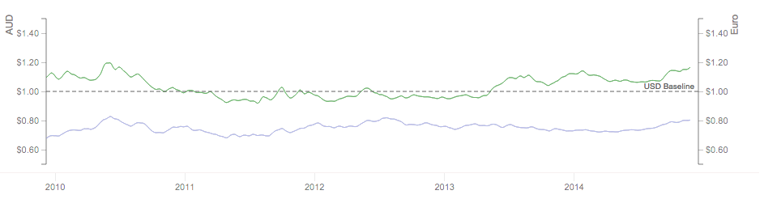

This library contains a set of modular React components used for building flexible interactive charts. Low level elements are constructed using d3, while high level composability is provided by React. What's so special about this? Charts can be stacked as rows, overlayed on top of each other, or any combination, all in a highly declarative manner. Any number of axes can be provided. What's more, the whole thing can be panned and zoomed.

Getting started
---------------

The charts library is intended to be used with npm and the built into your project with something like webpack.

    npm install react-timeseries-charts --save

Once installed, you can import the necessary components from the library:

    import { Charts, ChartContainer, ChartRow, YAxis, LineChart } from "react-timeseries-charts";

Then we construct our chart in the `render()` function of our component. The code to generate the above chart, specified in JSX, looks like this:

    <ChartContainer timeRange={series1.range()} padding="5">
        <ChartRow height="200">
            <YAxis id="axis1" label="AUD" min={0.5} max={1.5} width="60" type="linear" format="$,.2f"/>
            <Charts>
                <LineChart axis="axis1" series={series1}/>
                <LineChart axis="axis2" series={series2}/>
            </Charts>
            <YAxis id="axis2" label="Euro" min={0.5} max={1.5} width="80" type="linear" format="$,.2f"/>
        </ChartRow>
    </ChartContainer>

At the outer layer, we add a `ChartContainer` which contains our timerange for the x-axis. In this case we get the timerange from the series itself, but you could specify one yourself. We also specify some padding for our layout.

For the next layer of the layout we make a `ChartRow`. We can have multiple charts stacked on top of each other by using more than one row. In this case we just have one row. Each row has a specific height in the layout, so we specify that as 200px high here.

Next up we want to put something in our row. Rows contain a central flexible sized area in which charts can be added. This area is surrounded in the JSX by the `<Charts>` tag. Each chart in this area is overlaid on top of each other. In this case we are adding two `LineChart`s, one for each of our series and so they will be drawn on top of each other. For scaling each chart will reference an axis that will define the scale and display the y-scale.

Finally, we specify the axes that the charts reference. These go either before or after the `Charts` group, depending on if you want the axis before (to the left) or after the charts (to the right). You can specify any number of axes on either side. For each `YAxis` you specify the `id` so that a chart can reference it, the `label` you want displayed alongside the axis and, importantly, the scale using `min` and `max`. You can also specify the `width`, the `type` of the axis (`linear`, `log`, etc) and the `format`.

Data format
-----------

This charting library is built on the ESnet timeseries library called Pond. Pond was essentially created to provide a common representation for things like timeseries, timeranges, events and other structures. For the purpose of using the charting library, you need to create a TimeSeries() object as your series, which will be rendered by the chart code. For example:

    import {TimeSeries, TimeRange} from "pond";

    const series1 = new TimeSeries({
        "name": "my series",
        "labels": ["Time", "Currency"],
        "columns": ["time", "value"],
        "points": points
    });

Where `columns` must be 'time' and 'value' to work with the charts library, and `points` is of the format:

    [[time, value], [time, value], ...]

To specify a chart you also need to tell the chart code what time range to plot on. This is done with a TimeRange:

    var range = new TimeRange([begin, end]);

where begin and end are times.

Supported Chart types
---------------------

The main charts we use are:

- **Area chart** - which may be stacked in both directions, making it possible to generate up/down charts which we use to show network traffic.

- **Line charts**

- **Scatter charts**

- **Bar charts** (experimental)

- **Events** (very experimental)

In addition the library has the following features:

- **Baselines**

- **Brushes** for pan and zoom of the chart

- **Trackers** for hover indication

- **Legends**

Examples
--------

The repo contains an examples website. Within a cloned repo, you first need to run:

    npm install

This will install the development dependencies into your node_modules directory.

You can then start up the test server, as well as automatic source building, by doing:

    npm start

Then, point your browser to:

[http://localhost:8080/webpack-dev-server/](http://localhost:8080/webpack-dev-server/)

From now on, if you change the source code in the examples or lib/, webpack will rebuild the examples bundle and the browser will refresh itself. Errors will also be reported in the browser window.

NOTE: Both webpack and webpack-dev-server probably need to be installed globally for the cli to these tools to work. Also, if your system can't find these (i.e. if you install globally and then type `webpack` in the shell and get `command not found`) then this is because the global install location is not in your path. To find the location use this to find the prefix:

    npm config list | grep prefix

You path should include: prefix + "/bin" for installed cli.

Licence
-------

This code is distributed under a BSD style license, see the LICENSE file for complete information.

Copyright
---------

ESnet's React Timeseries Charts, Copyright (c) 2015, The Regents of the University of California, through Lawrence Berkeley National Laboratory (subject to receipt of any required approvals from the U.S. Dept. of Energy). All rights reserved.

If you have questions about your rights to use or distribute this software, please contact Berkeley Lab's Technology Transfer Department at TTD@lbl.gov.

NOTICE. This software is owned by the U.S. Department of Energy. As such, the U.S. Government has been granted for itself and others acting on its behalf a paid-up, nonexclusive, irrevocable, worldwide license in the Software to reproduce, prepare derivative works, and perform publicly and display publicly. Beginning five (5) years after the date permission to assert copyright is obtained from the U.S. Department of Energy, and subject to any subsequent five (5) year renewals, the U.S. Government is granted for itself and others acting on its behalf a paid-up, nonexclusive, irrevocable, worldwide license in the Software to reproduce, prepare derivative works, distribute copies to the public, perform publicly and display publicly, and to permit others to do so.
